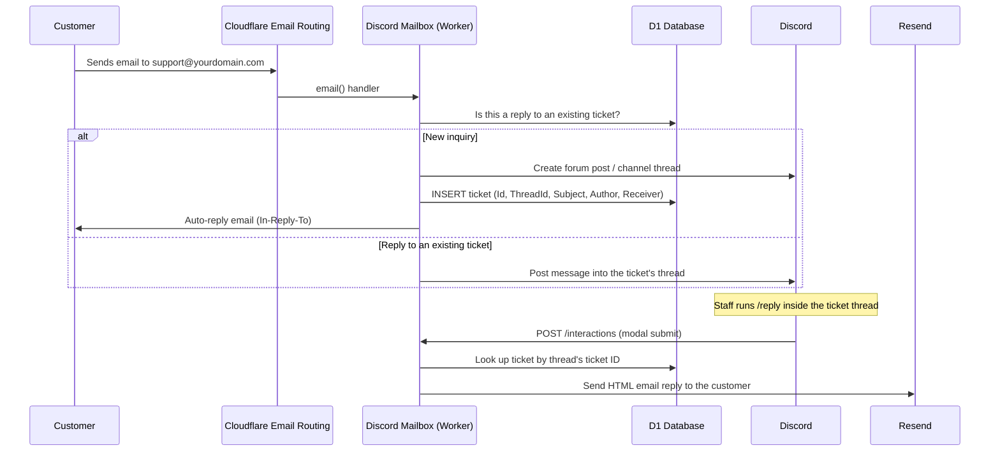

# Discord Mailbox

**[English](README.md) | [한국어](docs/README-ko.md)**

Turn a mailbox into a Discord ticketing system. Discord Mailbox is a [Cloudflare Workers](https://workers.cloudflare.com/) app that receives support emails via [Cloudflare Email Routing](https://developers.cloudflare.com/email-routing/), posts them into a Discord channel as threads/tickets, and lets your team reply from Discord — the reply is delivered back to the customer as an email via [Resend](https://resend.com/).

## How It Works



1. A customer emails a support address routed to this Worker via Cloudflare Email Routing.
2. The Worker parses the email and checks whether the subject matches an existing ticket (`[PREFIX] #TICKETID: ...`).
   - **New inquiry** → a new ticket ID is generated, a Discord forum post or a channel message + thread is created, the ticket is stored in D1, and an auto-reply email is sent back to the customer.
   - **Reply to an open ticket** → the email body (above the "reply here" marker) is posted as a message into the ticket's existing Discord thread.
3. Staff reply from Discord using the `/reply` slash command inside the ticket thread. It opens a modal; on submit, the Worker looks up the ticket in D1 and sends an HTML email to the customer via the Resend API, formatted with the staff member's name and avatar.

## Features

- **Email → Discord ticket**: incoming mail becomes a Discord forum post (with optional tags) or a channel thread, whichever the target channel supports.
- **Threaded conversations**: follow-up emails from the customer are appended to the same Discord thread instead of creating a new ticket.
- **Reply from Discord**: a `/reply` slash command with a modal lets staff answer without leaving Discord; replies are sent as real emails via Resend.
- **Tag routing**: route tickets to Discord forum tags based on the recipient's domain (`TLD_TAG`) or local part (`ADDRESS_TAG`) — e.g. `billing@` vs `support@`.
- **Attachment fallback**: long email bodies that exceed the Discord embed limit are automatically sent as a `.txt` file attachment instead of being truncated silently.
- **Optional forwarding**: incoming mail can be forwarded to another mailbox (`FORWARD_TO_ADDRESS`) in addition to being turned into a ticket.

## Tech Stack

| Layer | Choice |
|---|---|
| Runtime | [Cloudflare Workers](https://workers.cloudflare.com/) |
| HTTP framework | [h3](https://h3.dev/) |
| Database | [Cloudflare D1](https://developers.cloudflare.com/d1/) |
| Inbound email | [Cloudflare Email Routing](https://developers.cloudflare.com/email-routing/) + [`postal-mime`](https://github.com/postalsys/postal-mime) |
| Outbound email (auto-reply) | [`mimetext`](https://github.com/muratgozel/MIMEText) + Cloudflare's `EmailMessage` |
| Outbound email (staff replies) | [Resend](https://resend.com/) API |
| Discord integration | [`discord-api-types`](https://github.com/discordjs/discord-api-types), [`discord-interactions`](https://github.com/discord/discord-interactions-js), [`@discordjs/rest`](https://discord.js.org/) |
| Markdown → HTML | [`marked`](https://marked.js.org/) |
| Language | TypeScript |

## Prerequisites

- A [Cloudflare](https://dash.cloudflare.com/) account with a domain configured for [Email Routing](https://developers.cloudflare.com/email-routing/get-started/enable-email-routing/).
- The [Wrangler CLI](https://developers.cloudflare.com/workers/wrangler/install-and-update/), authenticated (`wrangler login`).
- A [Discord application + bot](https://discord.com/developers/applications) with the `applications.commands` and `bot` scopes, invited to your server with permission to send messages and manage threads in the target channel.
- A [Resend](https://resend.com/) account and API key, with a verified sending domain, for delivering staff replies.
- Node.js and [pnpm](https://pnpm.io/).

## Getting Started

### 1. Clone and install dependencies

```bash
git clone https://github.com/<your-org>/discord-mailbox.git
cd discord-mailbox
pnpm install
```

### 2. Create a Discord application

1. Create an application at the [Discord Developer Portal](https://discord.com/developers/applications) and add a bot to it.
2. Note the **Application ID**, **Public Key**, and **Bot Token**.
3. Invite the bot to your server with the `bot` and `applications.commands` scopes, and permissions to view/send messages, manage threads, and create posts in the target channel.
4. Create (or pick) a text, announcement, forum, or media channel to receive tickets, and note its channel ID.

### 3. Create a D1 database

```bash
wrangler d1 create discord-mailbox
```

Copy the resulting `database_id` into your Wrangler config (see step 6). The `Tickets` table is created automatically the first time you call `/register` (step 9) — no manual migration needed.

### 4. Configure Cloudflare Email Routing

In the Cloudflare dashboard, enable Email Routing for your domain and add a route that sends the address(es) you want to use (e.g. `support@yourdomain.com`) to this Worker. This is also where you'd add any [custom addresses](https://developers.cloudflare.com/email-routing/setup/email-routing-addresses/) you plan to use with `TLD_TAG` / `ADDRESS_TAG`.

### 5. Get a Resend API key

Create an API key in [Resend](https://resend.com/api-keys) and verify the domain you'll send replies from (it should match the address customers email, e.g. `yourdomain.com`).

### 6. Configure `wrangler.jsonc`

Copy the example config and fill in the blanks:

```bash
cp wrangler.example.jsonc wrangler.jsonc
```

```jsonc
{
  "name": "discord-mailbox",
  "main": "src/workers.ts",
  "compatibility_date": "2025-02-16",
  "d1_databases": [
    { "binding": "DB", "database_name": "discord-mailbox", "database_id": "<your-d1-database-id>" }
  ],
  "vars": {
    "FORWARD_TO_ADDRESS": "",              // optional: also forward raw email here
    "EMAIL_PREFIX": "Support",             // used in ticket subjects, e.g. "[Support] #ABC123: ..."
    "TLD_TAG": {},                         // e.g. { "@billing.yourdomain.com": "<forum-tag-id>" }
    "ADDRESS_TAG": {},                     // e.g. { "sales@": "<forum-tag-id>" }
    "DISCORD_CLIENT_ID": "<application-id>",
    "DISCORD_GUILD_ID": "<server-id>",
    "DISCORD_CHANNEL_ID": "<ticket-channel-id>",
    "DISCORD_EMBED_LIMIT": 4096,
    "DISCORD_FILE_LIMIT": 8000000
  }
}
```

> `TLD_TAG` / `ADDRESS_TAG` only apply when `DISCORD_CHANNEL_ID` points to a **forum** or **media** channel, since only those channel types support tags.

### 7. Set secrets

Secrets are kept out of `wrangler.jsonc` and set separately:

```bash
wrangler secret put DISCORD_BOT_TOKEN
wrangler secret put DISCORD_PUBLIC_KEY
wrangler secret put RESEND_API_KEY
```

### 8. Deploy

```bash
pnpm run deploy
```

### 9. Register commands and the interactions endpoint

Visit `https://<your-worker>.workers.dev/register` once (GET request) to create the `Tickets` table in D1 and register the `/reply` slash command with Discord.

Then, in the Discord Developer Portal, set your application's **Interactions Endpoint URL** to `https://<your-worker>.workers.dev/interactions`. Discord will verify it immediately using the `PING` handshake, so the Worker must already be deployed with the correct `DISCORD_PUBLIC_KEY`.

Visiting `https://<your-worker>.workers.dev/` returns a simple JSON health check confirming the required environment variables are set.

## Usage

- **New ticket**: a customer emails your routed address. A new Discord post/thread is created titled `#TICKETID: Subject`, and the customer receives an auto-reply confirming receipt.
- **Customer follow-up**: as long as the customer replies to that auto-reply (keeping the `[PREFIX] #TICKETID: ...` subject), their message is appended to the same Discord thread instead of opening a new ticket.
- **Staff reply**: inside the ticket's thread, run `/reply`, fill in the modal, and submit. The customer receives the reply as a Markdown-rendered HTML email from your verified Resend domain.

## Project Structure

```
src/
├── app.ts                     # h3 app + 404 fallback
├── workers.ts                 # Worker entrypoint (fetch + email handlers)
├── controllers/
│   ├── discord.controller.ts  # HTTP routes: /, /register, /interactions
│   └── email.controller.ts    # Cloudflare Email Workers `email()` handler
├── discord/
│   ├── actions.ts             # Modal submit handler for /reply
│   ├── channel.ts             # Discord channel-type lookup/cache
│   └── commands.ts            # /reply slash command definition
├── services/
│   ├── discord.service.ts     # Discord command registration + interaction verification
│   ├── mailbox.service.ts     # Email parsing + Discord message/thread payload builders
│   └── sendmail.service.ts    # Outbound email (auto-reply + staff reply via Resend)
└── types/                     # Shared TypeScript types
```

## Scripts

| Command | Description |
|---|---|
| `pnpm run dev` | Run the Worker locally against live Cloudflare resources (`wrangler dev --remote`) |
| `pnpm run deploy` | Deploy the Worker |
| `pnpm run generate-types` | Regenerate `worker-configuration.d.ts` from `wrangler.jsonc` |
| `pnpm run lint` | Run ESLint |

## License

Licensed under the [Apache License 2.0](LICENSE).
