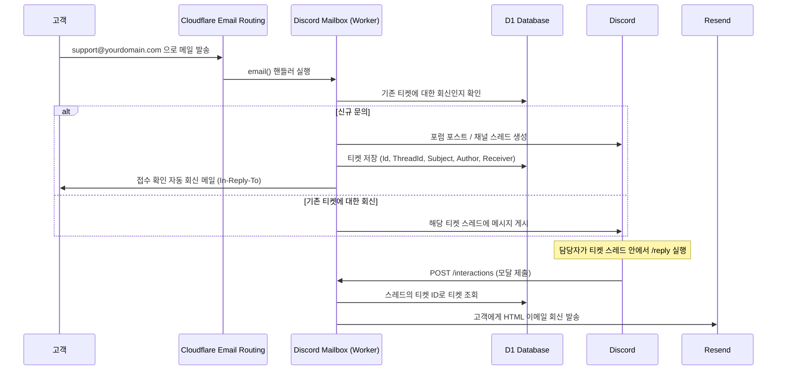

# Discord Mailbox

**[English](../README.md) | [한국어](README-ko.md)**

메일함을 Discord 티켓 시스템으로 바꿔주는 서비스입니다. Discord Mailbox는 [Cloudflare Workers](https://workers.cloudflare.com/) 위에서 동작하는 애플리케이션으로, [Cloudflare Email Routing](https://developers.cloudflare.com/email-routing/)을 통해 문의 메일을 받아 Discord 채널에 스레드(티켓)로 게시하고, 팀원이 Discord에서 답변하면 [Resend](https://resend.com/)를 통해 실제 이메일로 발송해줍니다.

## 동작 방식



1. 고객이 Cloudflare Email Routing으로 이 Worker에 연결된 지원 이메일 주소로 메일을 보냅니다.
2. Worker는 메일을 파싱한 뒤, 제목이 기존 티켓 형식(`[PREFIX] #TICKETID: ...`)과 일치하는지 확인합니다.
   - **신규 문의** → 새 티켓 ID를 생성하고, Discord 포럼 포스트 또는 채널 메시지+스레드를 생성한 후 D1에 티켓을 저장하고, 고객에게 접수 확인 자동 회신 메일을 보냅니다.
   - **기존 티켓에 대한 회신** → 메일 본문("회신은 이 줄 위에" 표시 위쪽 내용)이 해당 티켓의 기존 Discord 스레드에 메시지로 게시됩니다.
3. 담당자는 티켓 스레드 안에서 `/reply` 슬래시 커맨드를 실행해 Discord에서 바로 답변합니다. 모달 창이 열리고, 제출하면 Worker가 D1에서 해당 티켓을 조회한 뒤 담당자의 이름과 아바타가 포함된 HTML 이메일을 Resend API를 통해 고객에게 발송합니다.

## 주요 기능

- **이메일 → Discord 티켓**: 수신된 메일은 대상 채널이 지원하는 형태에 따라 Discord 포럼 포스트(태그 지정 가능) 또는 채널 스레드로 변환됩니다.
- **스레드 기반 대화**: 고객의 후속 메일은 새 티켓을 만드는 대신 기존 Discord 스레드에 이어서 게시됩니다.
- **Discord에서 바로 회신**: 티켓 스레드 안에서 `/reply` 슬래시 커맨드와 모달을 사용해 Discord를 벗어나지 않고 답변할 수 있으며, 회신은 Resend를 통해 실제 이메일로 발송됩니다.
- **태그 라우팅**: 수신 주소의 도메인(`TLD_TAG`) 또는 로컬 파트(`ADDRESS_TAG`)를 기준으로 Discord 포럼 태그에 티켓을 분류할 수 있습니다 (예: `billing@` vs `support@`).
- **첨부파일 폴백**: 메일 본문이 Discord 임베드 글자 수 제한을 넘으면 내용이 잘리지 않고 자동으로 `.txt` 파일로 첨부됩니다.
- **선택적 전달**: 티켓 생성과 별개로, 수신 메일을 다른 메일함(`FORWARD_TO_ADDRESS`)으로도 전달할 수 있습니다.

## 기술 스택

| 구성 요소 | 선택 |
|---|---|
| 런타임 | [Cloudflare Workers](https://workers.cloudflare.com/) |
| HTTP 프레임워크 | [h3](https://h3.dev/) |
| 데이터베이스 | [Cloudflare D1](https://developers.cloudflare.com/d1/) |
| 수신 메일 처리 | [Cloudflare Email Routing](https://developers.cloudflare.com/email-routing/) + [`postal-mime`](https://github.com/postalsys/postal-mime) |
| 발신 메일 (자동 회신) | [`mimetext`](https://github.com/muratgozel/MIMEText) + Cloudflare `EmailMessage` |
| 발신 메일 (담당자 회신) | [Resend](https://resend.com/) API |
| Discord 연동 | [`discord-api-types`](https://github.com/discordjs/discord-api-types), [`discord-interactions`](https://github.com/discord/discord-interactions-js), [`@discordjs/rest`](https://discord.js.org/) |
| Markdown → HTML 변환 | [`marked`](https://marked.js.org/) |
| 언어 | TypeScript |

## 사전 준비물

- [Email Routing](https://developers.cloudflare.com/email-routing/get-started/enable-email-routing/)이 설정된 도메인을 가진 [Cloudflare](https://dash.cloudflare.com/) 계정
- 인증된 [Wrangler CLI](https://developers.cloudflare.com/workers/wrangler/install-and-update/) (`wrangler login` 완료)
- `applications.commands`와 `bot` 스코프를 가진 [Discord 애플리케이션 + 봇](https://discord.com/developers/applications). 대상 채널에서 메시지 전송 및 스레드 관리 권한과 함께 서버에 초대되어 있어야 합니다.
- 담당자 회신 발송을 위한 [Resend](https://resend.com/) 계정, API 키, 그리고 인증된 발신 도메인
- Node.js와 [pnpm](https://pnpm.io/)

## 시작하기

### 1. 클론 및 의존성 설치

```bash
git clone https://github.com/<your-org>/discord-mailbox.git
cd discord-mailbox
pnpm install
```

### 2. Discord 애플리케이션 생성

1. [Discord 개발자 포털](https://discord.com/developers/applications)에서 애플리케이션을 생성하고 봇을 추가합니다.
2. **Application ID**, **Public Key**, **Bot Token**을 기록해 둡니다.
3. `bot`과 `applications.commands` 스코프로 봇을 서버에 초대하고, 대상 채널에서 메시지 조회/전송, 스레드 관리, 포스트 생성 권한을 부여합니다.
4. 티켓을 받을 텍스트, 공지, 포럼, 또는 미디어 채널을 생성(또는 선택)하고 채널 ID를 기록해 둡니다.

### 3. D1 데이터베이스 생성

```bash
wrangler d1 create discord-mailbox
```

생성된 `database_id`를 Wrangler 설정 파일에 복사해 넣습니다 (6단계 참고). `Tickets` 테이블은 `/register`를 처음 호출할 때(9단계) 자동으로 생성되므로 별도의 마이그레이션이 필요 없습니다.

### 4. Cloudflare Email Routing 설정

Cloudflare 대시보드에서 도메인의 Email Routing을 활성화하고, 사용할 주소(예: `support@yourdomain.com`)를 이 Worker로 보내는 라우트를 추가합니다. `TLD_TAG` / `ADDRESS_TAG`와 함께 사용할 [커스텀 주소](https://developers.cloudflare.com/email-routing/setup/email-routing-addresses/)도 이곳에서 추가하면 됩니다.

### 5. Resend API 키 발급

[Resend](https://resend.com/api-keys)에서 API 키를 생성하고, 회신 발송에 사용할 도메인(고객이 메일을 보낸 주소와 일치해야 함, 예: `yourdomain.com`)을 인증합니다.

### 6. `wrangler.jsonc` 설정

예제 설정 파일을 복사한 뒤 값을 채워 넣습니다.

```bash
cp wrangler.example.jsonc wrangler.jsonc
```

```jsonc
{
  "name": "discord-mailbox",
  "main": "src/workers.ts",
  "compatibility_date": "2025-02-16",
  "d1_databases": [
    { "binding": "DB", "database_name": "discord-mailbox", "database_id": "<your-d1-database-id>" }
  ],
  "vars": {
    "FORWARD_TO_ADDRESS": "",              // 선택 사항: 원본 메일을 추가로 전달할 주소
    "EMAIL_PREFIX": "Support",             // 티켓 제목에 사용됨, 예: "[Support] #ABC123: ..."
    "TLD_TAG": {},                         // 예: { "@billing.yourdomain.com": "<forum-tag-id>" }
    "ADDRESS_TAG": {},                     // 예: { "sales@": "<forum-tag-id>" }
    "DISCORD_CLIENT_ID": "<application-id>",
    "DISCORD_GUILD_ID": "<server-id>",
    "DISCORD_CHANNEL_ID": "<ticket-channel-id>",
    "DISCORD_EMBED_LIMIT": 4096,
    "DISCORD_FILE_LIMIT": 8000000
  }
}
```

> `TLD_TAG` / `ADDRESS_TAG`는 `DISCORD_CHANNEL_ID`가 **포럼** 또는 **미디어** 채널을 가리킬 때만 적용됩니다. 태그는 해당 채널 타입에서만 지원되기 때문입니다.

### 7. 시크릿 설정

민감한 값은 `wrangler.jsonc`에 두지 않고 별도로 설정합니다.

```bash
wrangler secret put DISCORD_BOT_TOKEN
wrangler secret put DISCORD_PUBLIC_KEY
wrangler secret put RESEND_API_KEY
```

### 8. 배포

```bash
pnpm run deploy
```

### 9. 커맨드 및 인터랙션 엔드포인트 등록

`https://<your-worker>.workers.dev/register`에 한 번(GET 요청) 접속하면 D1에 `Tickets` 테이블이 생성되고 `/reply` 슬래시 커맨드가 Discord에 등록됩니다.

이후 Discord 개발자 포털에서 애플리케이션의 **Interactions Endpoint URL**을 `https://<your-worker>.workers.dev/interactions`로 설정합니다. Discord는 `PING` 핸드셰이크로 즉시 이 URL을 검증하므로, 그 전에 올바른 `DISCORD_PUBLIC_KEY`로 Worker가 이미 배포되어 있어야 합니다.

`https://<your-worker>.workers.dev/`에 접속하면 필수 환경 변수가 설정되어 있는지 확인할 수 있는 간단한 JSON 헬스체크 응답을 받을 수 있습니다.

## 사용 방법

- **신규 티켓**: 고객이 라우팅된 주소로 메일을 보내면 `#TICKETID: 제목` 형식의 Discord 포스트/스레드가 새로 생성되고, 고객은 접수를 확인하는 자동 회신 메일을 받습니다.
- **고객 후속 메일**: 고객이 자동 회신 메일에 답장하는 형태로(제목의 `[PREFIX] #TICKETID: ...` 형식이 유지되는 한) 메일을 보내면, 새 티켓이 아니라 기존 Discord 스레드에 메시지가 이어서 게시됩니다.
- **담당자 회신**: 티켓 스레드 안에서 `/reply`를 실행하고 모달을 작성해 제출합니다. 고객은 인증된 Resend 도메인에서 발송된, Markdown이 HTML로 렌더링된 이메일로 회신을 받습니다.

## 프로젝트 구조

```
src/
├── app.ts                     # h3 앱 + 404 폴백
├── workers.ts                 # Worker 진입점 (fetch + email 핸들러)
├── controllers/
│   ├── discord.controller.ts  # HTTP 라우트: /, /register, /interactions
│   └── email.controller.ts    # Cloudflare Email Workers `email()` 핸들러
├── discord/
│   ├── actions.ts             # /reply 모달 제출 핸들러
│   ├── channel.ts             # Discord 채널 타입 조회/캐시
│   └── commands.ts            # /reply 슬래시 커맨드 정의
├── services/
│   ├── discord.service.ts     # Discord 커맨드 등록 + 인터랙션 검증
│   ├── mailbox.service.ts     # 이메일 파싱 + Discord 메시지/스레드 페이로드 생성
│   └── sendmail.service.ts    # 발신 메일 (자동 회신 + Resend를 통한 담당자 회신)
└── types/                     # 공용 TypeScript 타입
```

## 스크립트

| 명령어 | 설명 |
|---|---|
| `pnpm run dev` | 실제 Cloudflare 리소스에 연결해 로컬에서 Worker 실행 (`wrangler dev --remote`) |
| `pnpm run deploy` | Worker 배포 |
| `pnpm run generate-types` | `wrangler.jsonc`를 기준으로 `worker-configuration.d.ts` 재생성 |
| `pnpm run lint` | ESLint 실행 |

## 라이선스

[Apache License 2.0](../LICENSE)에 따라 라이선스가 부여됩니다.
